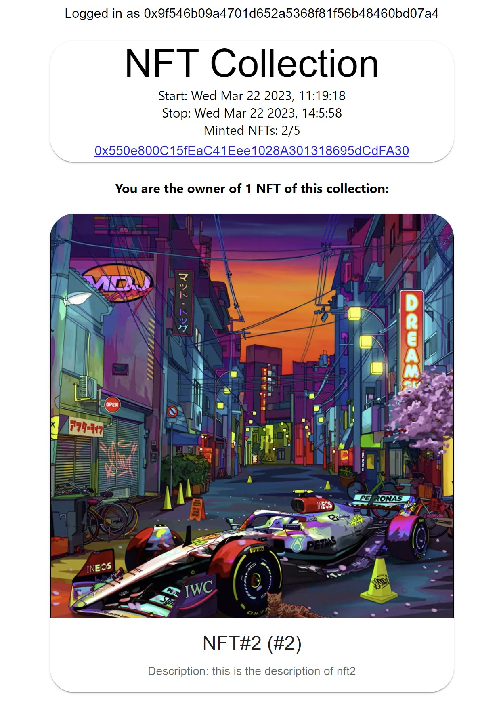

# NFT-Minting

Example of implementation of an NFTCollection following ERC721 standard with the following features: 
* Mint is possible only during a certain duration 
* One wallet can mint only one NFT
* Only X NFT can be minted (X specified in the constructor of the contract)
* NFT must have metadata

NB: Please note that all metadata must be included in the tokenURI parameter when calling the mintNFT() function.  
This tokenURI can include any information: name, description, and imageURL.  

When testing this project from the DApp, the tokenURI will be generated from data received on IPFS.  (More info in `frontend/README.md`)
<p align="center">

</p>

## Structure of the project
### 1. Smart contracts - `contract/` 
Smart contracts are implemented with **Solidity** and require the **version 0.8.0** of the compiler. 
* `NFTCollection.sol`  
The NFTCollection contract, the main file of the project, where the user can mint NFT.

### 2. Tests - `test/`
Unit tests for `NFTCollection.sol` collection

### 3. Scripts - `scripts/`
Deployment script

### 4. DApp - `frontend/`  
DApp implemented with React and Typescript to interact with the NFTCollection contract once deployed.  
More info about the DApp can be found in this UI in `frontend/README.md`

## How to run?
### Stack
* NodeJS (v >= 12.0.0)
* npm 
* Hardhat 
* Solidity (v0.8.0)

### Install dependencies and run tests
1. `npm install`
2. `npx hardhat compile` (to compile contracts and generate artifacts)
3. `npx hardhat test` (to run existing unit tests)  

## Testing
The NFTCollection contract has been tested using **Hardhat** framework and **Chai** library.   
To run the test, please make sure all dependencies are installed and use the following command: `npx hardhat test`.

Below is an overview of the tests for the `NFTCollection.sol` contract: 
```
  MyNFT contract
    Deploy contract
      Success -  Deploy contract with valid parameters
        ✔ Should deploy the contract with the correct name and symbol (1227ms)
        ✔ Should deploy the contract with correct maxNFTs, mintWindowsStart, mintWindowsEnd (88ms)
      Failure -  Deploy contract with invalid parameters
        ✔ Should fail to deploy if maxNFTs param is invalid (49ms)
        ✔ Should fail to deploy if not time window is invalid (59ms)
    Function getMyNFT()
      ✔ Success - Should retrieve the NFT ID of the owner of an NFT (83ms)
      ✔ Failure - Should return 0 if the user does not own any NFT (68ms)
    Function MintNFT()
      ✔ Failure - Should fail to mint if wallet already minted one token (76ms)
      ✔ Failure - Should fail to mint if all NFT are already minted (129ms)
      ✔ Success - Should mint an NFT successfully (87ms)
      ✔ Failure - Should fail when time minting time windows is over (59ms)
    Function getCurrentToken()
      ✔ Success - Should return 0 if no tokens are minted (62ms)
      ✔ Success - Should return 2 if 2 tokens are minted (89ms)


  12 passing (2s)
```

## Deployment
As mentioned above, this project has been developed and tested using Sepolia testnet and Infura.   
To deploy, you must first create a `.env` file and add 2 keys:
```
# .env 
WALLET_PRIVATE_KEY=<YOUR SEPOLIA WALLET PRIVATE KEY>
INFURA_API_KEY=<YOUR INFURA API KEY>
```


Then, you can run this command: `npx hardhat run scripts/deploy.js --network sepolia`  
The deployment configuration file can be found in the file `hardhat.config.ts` and the script to deploy in `scripts/deploy.ts`.    
Make sure you have enough eth faucets before deploying. 

For more information, please check this tutorial: https://hardhat.org/tutorial/deploying-to-a-live-network.html


## Documentation
* Hardhat tutorials: https://hardhat.org/tutorial/
* OpenZepplin contracts: https://github.com/OpenZeppelin/openzeppelin-contracts/tree/master/contracts/token
