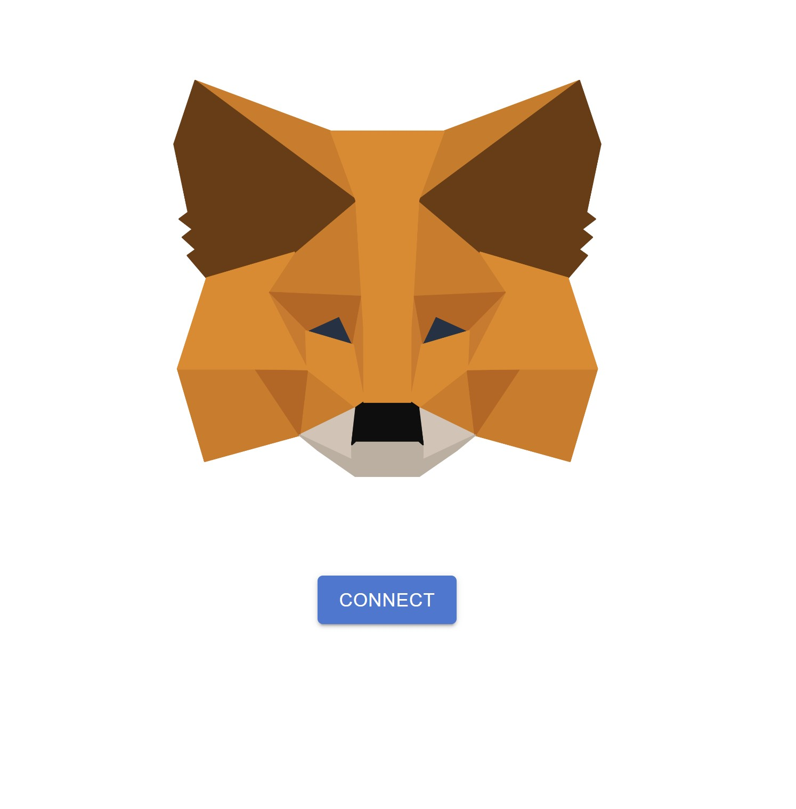
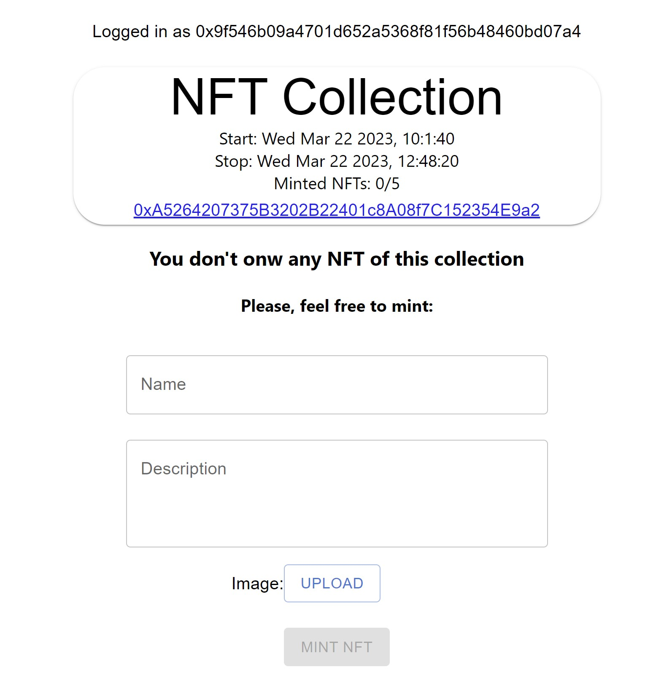
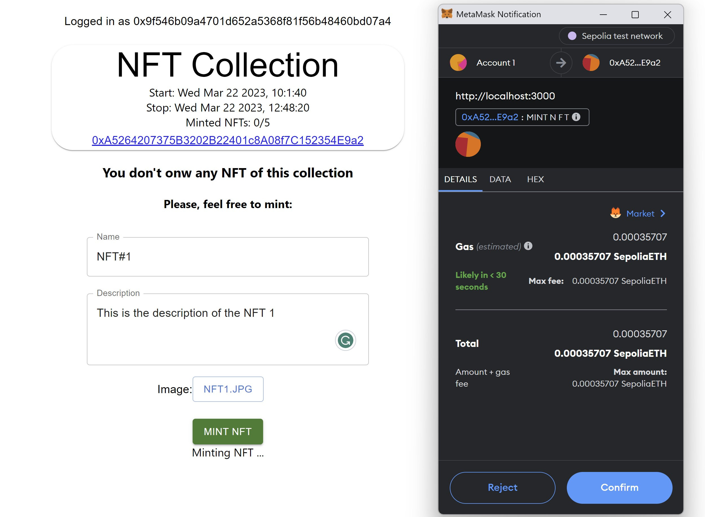
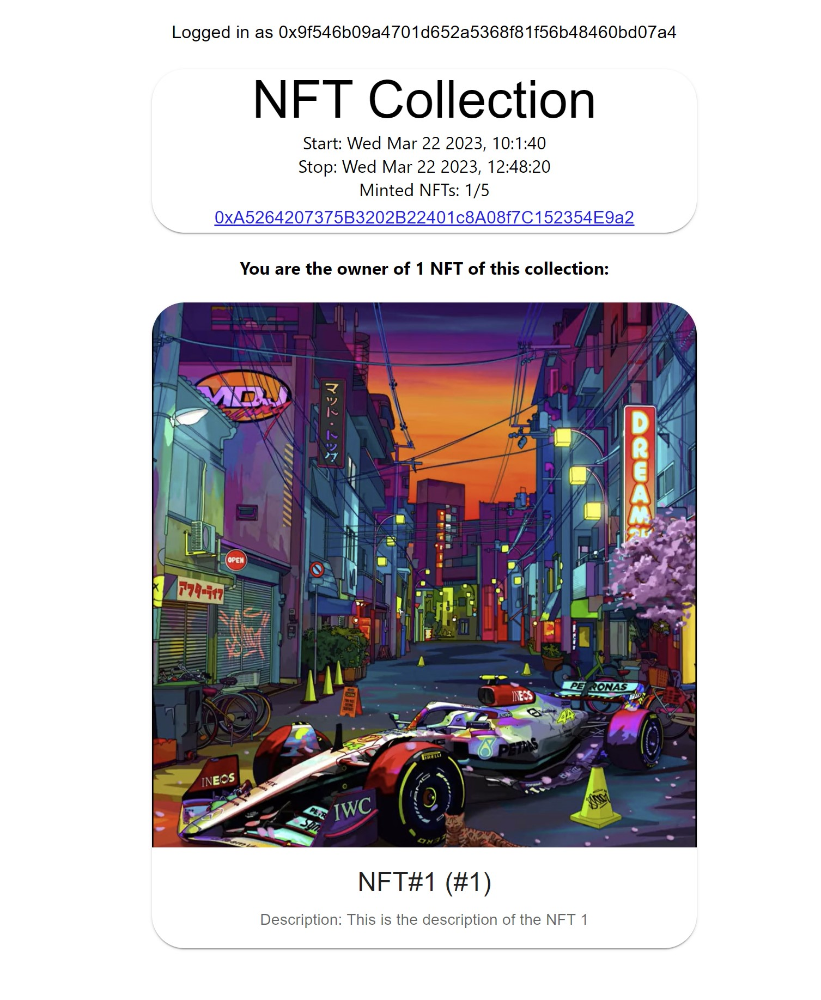
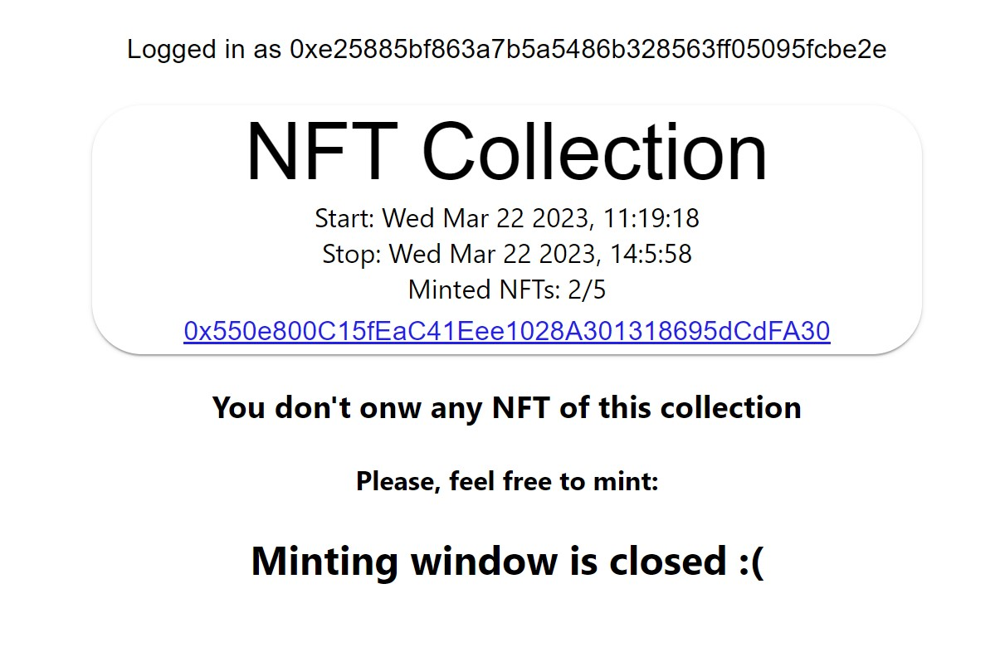

# Getting Started with Create React App

Simple react app to test the mintNFT() function of the `NFTCollection.sol` contract.  
Before running the app, please make you have all the requirements set up on your local environment.  

This app is using Metamask, with **Sepolia** testnet.  Before running the app, you might add the **Sepolia** network to your metamask extension and get some eth faucet (https://faucet-sepolia.rockx.com/)  

When submitting the "Mint" button on the UI, 3 things will happen:
1. Upload the picture to Pinata
2. Upload of metadata to Pinata
3. Minting of the NFT with the Metadata

It can take a few moments before the picture is fully uploaded on IPFS so after minting, you might need to wait a few moments before the UI will render the picture.

This project was bootstrapped with [Create React App](https://github.com/facebook/create-react-app).

## How to run?
### Requirements
* node and npm
* a webbrowser with Metamask installed, with `Sepolia` network
* a `.env` file with the following: 
```
#.env
REACT_APP_PINATA_KEY=<YOUR PINATA KEY>
REACT_APP_PINATA_SECRET=<YOUR PINATA SECRET>
```

NB: Create an account and generate a new key for this project on https://www.pinata.cloud/

### Install dependencies and run
1. `npm install`
2. `npm start`

Runs the app in development mode.\
Open [http://localhost:3000](http://localhost:3000) to view it in the browser.

## Examples:
### 1. Connection page: 
  

### 2. If Metamask is missing in your browser, UI shows error message: 


### 3. Enable user to Mint if he/she doesn't own any NFT yet:  


### 4. Open Metamask for signature when minting:  


### 5. Show NFT the logged-in user owns:  


### 6. A user that doesn't own any NFT cannot mint if the minting window is closed:



